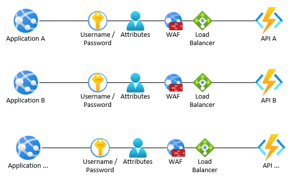
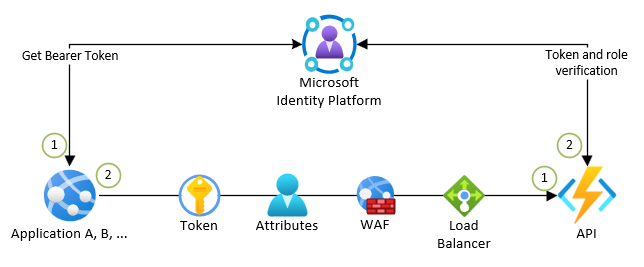
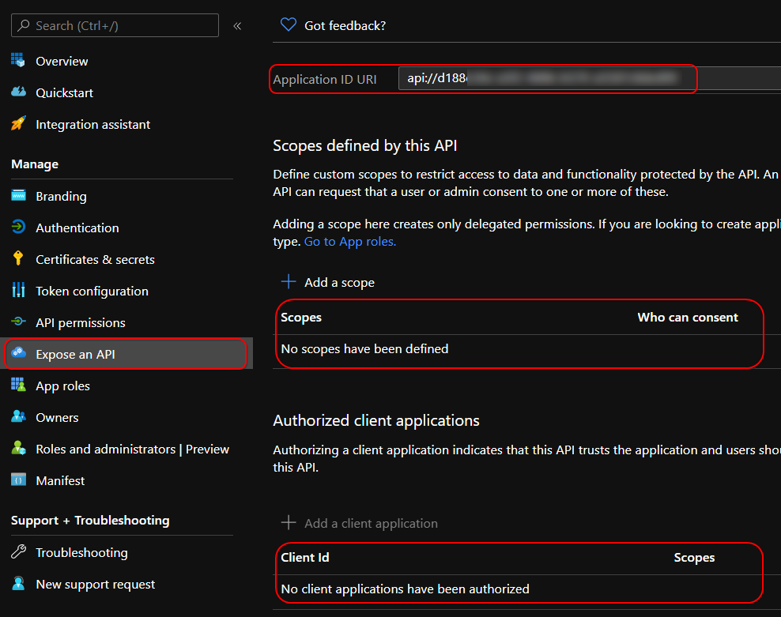
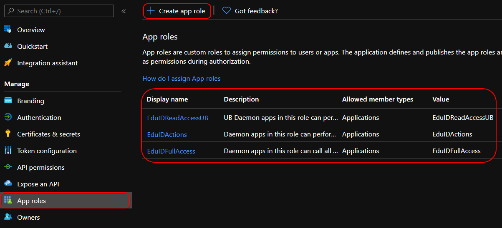
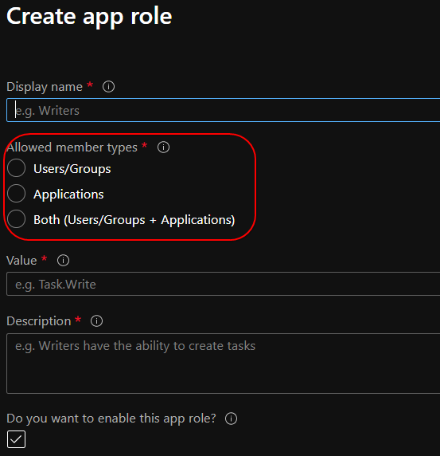
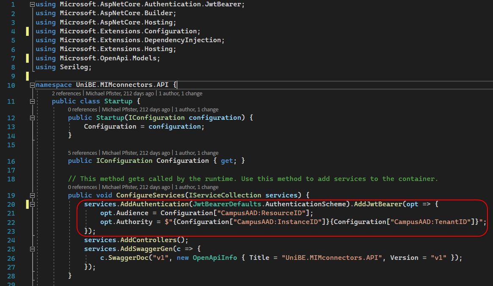
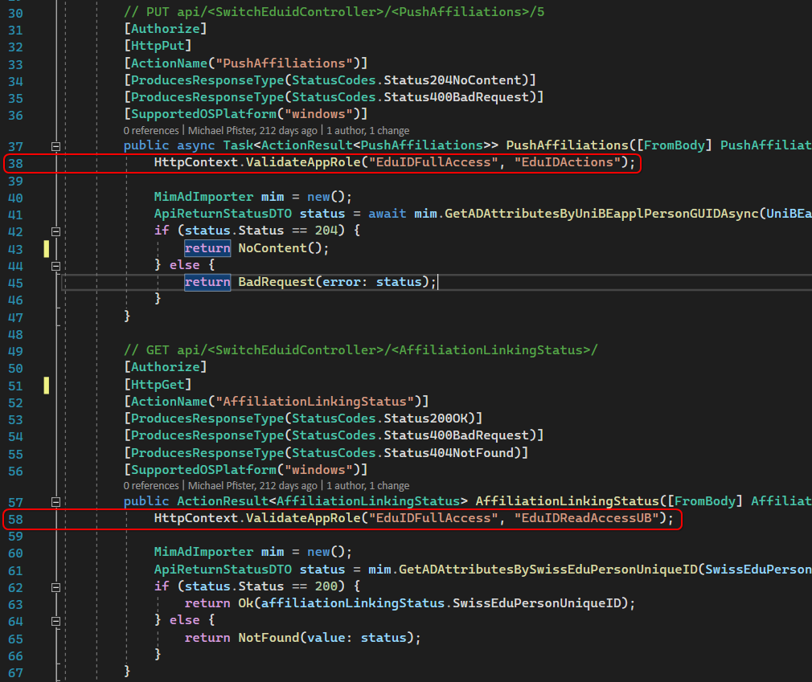
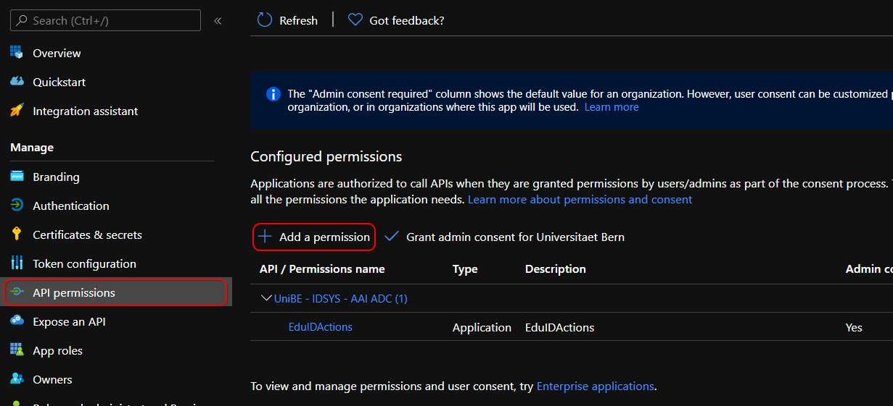
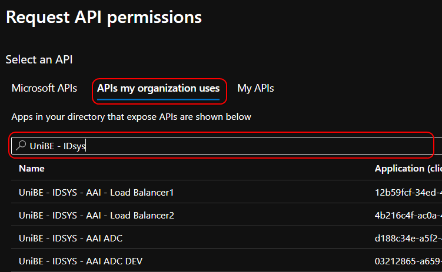
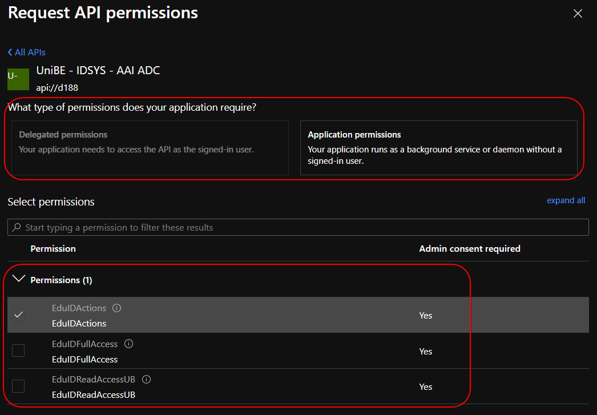

# Schnittstellen mit Applikationsrollen absichern

Schnittstellen zu bestimmten Zielsystemen werden häufig nicht nur von einer einzigen Applikation genutzt.  

Damit man als Entwickler nun nicht für jede Client Applikation eine eigene Schnittstelle und damit einen immer ähnlichen Code wiederverwenden muss, gibt es via oAuth 2 die Möglichkeit mit Applikationsrollen zu arbeiten.  

**Klassischer Schnittstellenaufbau**  
  

**Moderner Ansatz**  
  

Der Vorteil des modernen Ansatzes liegt auf der Hand; man richtet nur eine zentrale aber dafür modulare API ein und muss nur eine Applikationspublikation betreuen, wodurch dann auch Dinge entfallen wie bei jeder neuen API Firewallports öffnen zu müssen, IP Einschränkungen zu definieren und Load Balancer Einträge zu erstellen.

Der Vorgang eines solchen Aufbaues ist dabei wie folgt.  

## API auf der Microsoft Identity Platform erfassen

1. Am Azure Portal anmelden und [die Application Developer Rolle aktivieren](./appdev-role.md).  
2. Unter ***App registrations*** die API als neue OIDC Applikation erfassen.  
3. In den Reiter ***Expose an API*** wechseln.  
4. Sollte noch keine Application ID URI gesetzt sein, muss diese über ***Set*** erstellt werden.  
5. Sollten Scopes oder Client IDs vorhanden sein, sind diese zu löschen.  
  

## Applikationsrollen auf der Microsoft Identity Platform definieren

Auf der Schnitttstelle wird der Zugriff nicht wie bis anhin über IP-Zugriffe oder Benutzernamen / Passwort Kombinationen, sondern über Applikationsrollen gesteuert.  

Dafür müssen diese in unserer API App Registrierung erfasst und in einem späteren Schritt von der Client Applikation angefordert werden.

1. In den Reiter ***App roles*** wechseln und etwaige, vorhandene Rollen löschen.  
  
2. Die benötigten Rollen erstellen.  
  

!!! note
    An dieser Stelle muss entschieden werden, welcher oAuth 2 Flow genutzt wird.  
    Eine Daemon App wird immer im Applikationskontext auf die API zugreifen. Bei einer Web Applikation kann es aber sinnvoll sein, die API im Benutzerkontext anzusprechen, bspw. um benutzerspezifische Informationen abzurufen oder die Zugriffe über Benutzerrollen (User, Administrator, Editor, etc.) zu steuern.

## Applikationsrollen in der API definieren

Die soeben erstellten Rollen können nun in der API bzw. den API Controller Actions dazu genutzt werden, die Zugriffe zu steuern.

Nachfolgend ein Beispiel für eine .NET 5 WebAPI

*C# (.NET 5)*
1. Deklarieren der Authentication Parameter in der Startup.cs  
  

!!! info
    ResourceID = Exposed API Url api://...  
    InstanceID = https://login.microsoftonline.com/  
    TenantID = Die TenantID der Organisation

2. Rollenprüfung innerhalb der API Controller Action  
  

Damit ist die Konfiguration der API abgeschlossen.  

## Client Applikation auf der Microsoft Identity Platform erfassen

Im nächsten Schritt wird die Client Applikation eingerichtet, welche auf die API zugreifen soll.  

1. Am Azure Portal anmelden und [die Application Developer Rolle aktivieren](./appdev-role.md).  
2. Unter ***App registrations*** die Client Applikation als neue OIDC Applikation erfassen.  
3. Unter ***Certificates & Secrets*** ein neues Shared Secret erstellen oder, was empfohlen wird, mit Zertifikaten arbeiten.  

## Applikationsrolle(n) für die Ziel-API anfordern

Damit die Client Applikation unter Verwendung bestimmter Rollen auf die API zugreifen kann, müssen diese auf der Microsoft Identity Platform angefordert werden.  

1. In den Reiter ***API permissions*** wechseln und auf ***Add a permission*** klicken. Etwaige, vorhandene Berechtigungen sind zu löschen.  
  
2. In den Reiter ***APIs my organization uses*** wechseln, die zuvor erfasste API suchen und auswählen.  
  
3. Den gewünschten Zugriffstyp und die benötigte Rolle auswählen. Die verfügbaren Zugriffstypen sind dabei abhängig vom zuvor bei der API Konfiguration gewählten oAuth 2 Flow.  
  

Um einen Missbrauch zu verhindern, ist es ab diesem Schritt erforderlich einen Azure Applikations-Administrator zu kontaktieren, damit dieser beim API-Anbieter eine Bestätigung für die Rollenfreigabe einholen und die angeforderten Rollen freigeben kann.  

## Client Applikation vorbereiten

Der Vorgang seitens Client Applikation ist so, dass immer erst ein AccessToken von der Microsoft Identity Platform angefordert werden muss, welches anschliessend für den API Aufruf genutzt werden kann.  
Die Gültigkeit eines AccessTokens beträgt im Standard zwei Stunden.  

Für die Microsoft Identity Platform wird der Zugriff idealerweise über die MSAL Library gemacht, welche [für alle aktuellen Programmier- und Scriptsprachen angeboten wird](https://docs.microsoft.com/en-us/azure/active-directory/develop/reference-v2-libraries).

Ebenso sollte vor dem Bezug eines neuen AccessTokens geprüft werden, [ob noch ein gültiges Token im Cache vorhanden ist](https://docs.microsoft.com/en-us/azure/active-directory/develop/msal-acquire-cache-tokens).

Für den Bezug des AccessTokens gibt es diverse oAuth 2 Authentication Flows[^1] , wichtig sind aber folgende:  

### oAuth 2 Authorization code flow

**Anwendung:** Mobile Apps sowie Single Page WebApplikationen (Blazor, Angular, Vue.js, React.js)  

[Weitere Informationen](https://docs.microsoft.com/en-us/azure/active-directory/develop/v2-oauth2-auth-code-flow)  
[Implementierung WebApp](https://docs.microsoft.com/en-us/azure/active-directory/develop/scenario-web-app-call-api-acquire-token?tabs=aspnetcore)  
[Implementierung MobileApp](https://docs.microsoft.com/en-us/azure/active-directory/develop/scenario-mobile-acquire-token)

### oAuth 2 Client credentials flow

**Anwendung:** Daemon Apps (nicht interaktive Applikationen)  

Bei dieser Methode wird entweder mittels Client Secret (Shared Secret) oder aber, was empfohlen wird, mittels Zertifikat ein AccessToken bezogen.  

[Weitere Informationen](https://docs.microsoft.com/en-us/azure/active-directory/develop/v2-oauth2-client-creds-grant-flow)  
[Implementierung](https://docs.microsoft.com/en-us/azure/active-directory/develop/scenario-daemon-acquire-token?tabs=dotnet)

[^1]:
    Übersicht der oAuth 2 Authentication Flows:  
    [https://docs.microsoft.com/en-us/azure/active-directory/develop/msal-authentication-flows](https://docs.microsoft.com/en-us/azure/active-directory/develop/msal-authentication-flows)