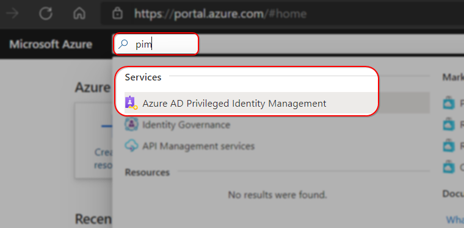
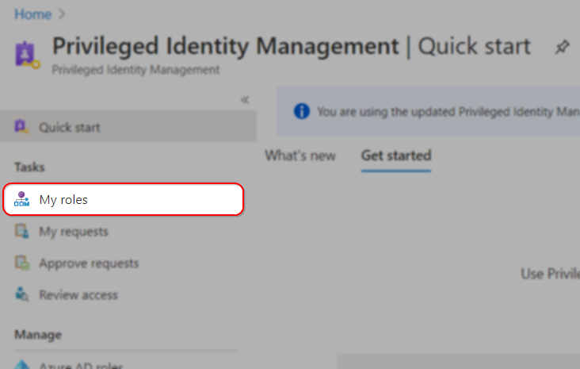
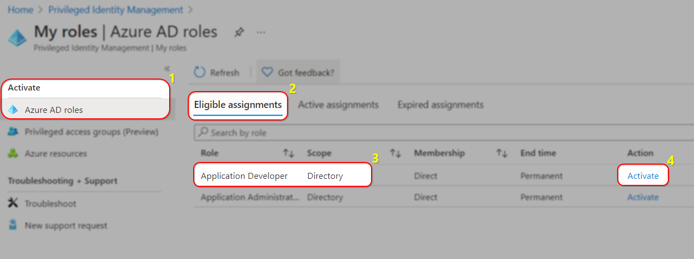
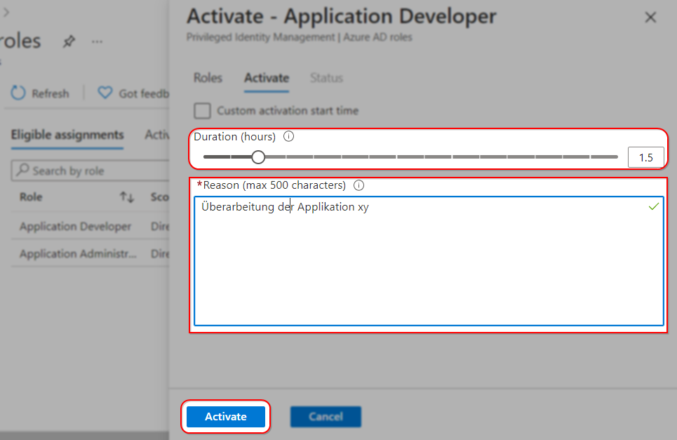

# Application Developer Rolle

Die Application Developer Rolle ermöglicht es Ihnen, Ihre Applikationen in Azure zu registrieren und damit eine Authentisierung mit dem Campus Account via OIDC[^1] oder SAML2[^2] zu realisieren.

Für den Austausch mit anderen Entwicklern bieten wir Ihnen unsere [IT-Community Foren](https://id-forums.unibe.ch/) an.

## Bestellung der Application Developer Rolle
Wenn Sie eine Applikation anbinden möchten, melden Sie sich bitte bei uns unter aai@id.unibe.ch.

Wir werden Sie bei der ersten Applikation noch unterstützen und diese zusammen mit Ihnen entweder mit SAML2 oder OIDC an das Microsoft Identity System anbinden.  
Im Anschluss daran werden wir Ihnen auf Wunsch die Application Developer Rolle freischalten damit Sie OIDC Anbindungen eigenständig vornehmen und OIDC/SAML2 Anbindungen verwalten können.

Die Anbindung mittels SAML2 bedarf immer unserer Mithilfe aber Sie können die Berechtigungen anschliessend eigenständig verwalten.

## Aktivierung und Nutzung der Application Developer Rolle

### Voraussetzungen
- Sie sind als IT-Verantwortliche/r für Ihr Institut registriert.
- Sie besitzen einen cloud-ready Campus Account[^3].
- Ihr Account ist MFA aktiviert.
- (geplant) Sie verwenden den Microsoft Edge Chromium Browser in der aktuellsten Version.
- (geplant) Sie besitzen eine verifiable credential für diese Dienstleistung.

### Anmeldung
1. Melden Sie sich mit Ihrem Campus Account an https://portal.azure.com an.

### Rollenaktivierung
1. Wechseln Sie im Azure Portal in das Priviledged Identity Management, entweder indem Sie das Icon in Ihrem Dasboard anklicken, oder über die Suchfunktion mit dem Suchbegriff ***pim***.  
  
2. Wählen Sie in der Navigationleiste den Navigationspunkt ***My roles*** um eine Übersicht Ihrer verfügbaren Rollen zu erhalten.  
  
3. Wählen Sie die Rolle ***Application Developer*** und klicken Sie auf ***Activate***  
  
4. Im nächsten Schritt können Sie festlegen, für wie viele Stunden Sie die Rolle benötigen.  
Wählen Sie hier eine möglichst akkurate Anzahl an Stunden aus, um Ihren Account und unsere Systeme zu schützen.  
  
5. Azure wird nun eine Überprüfung Ihres Accounts vornehmen und Sie bei Bedarf zu einer MFA Verifizierung auffordern. Anschliessend steht Ihnen die Application Developer Rolle für die von Ihnen gewählte Zeit zur Verfügung.

[^1]: [Details zum OpenID Connect Protokoll](https://docs.microsoft.com/en-us/azure/active-directory/develop/v2-protocols-oidc)
[^2]: [Details zum SAML 2.0 Protokoll](https://docs.microsoft.com/en-us/azure/active-directory/develop/single-sign-on-saml-protocol)
[^3]: Ein Campus Account dessen E-Mail Adresse vorname.nachname@unibe.ch dem Anmeldenamen entspricht.