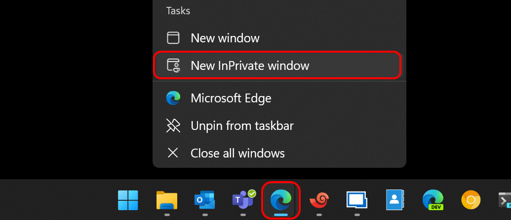
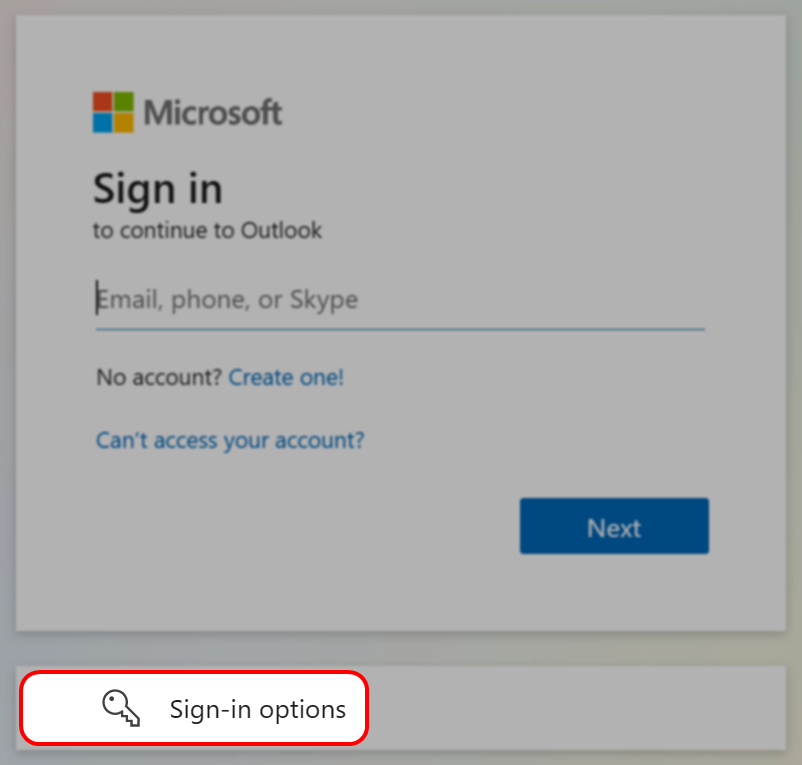
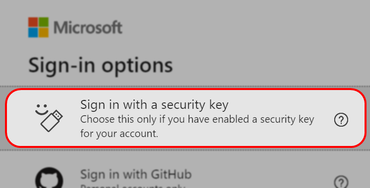
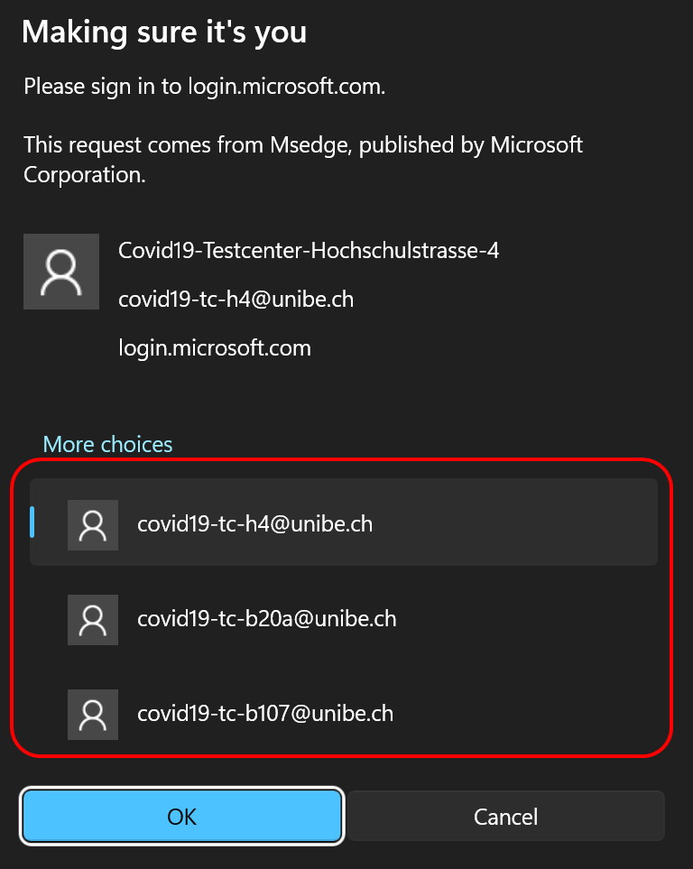
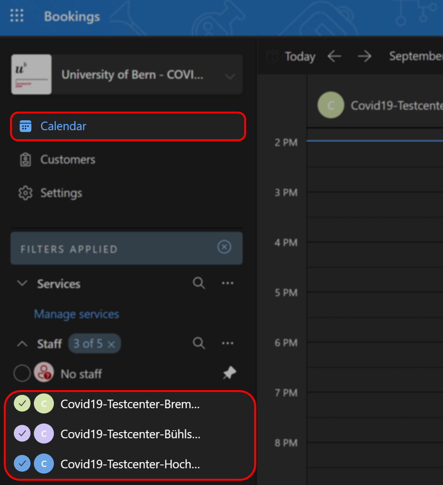
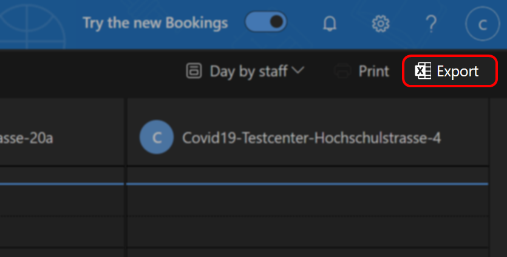
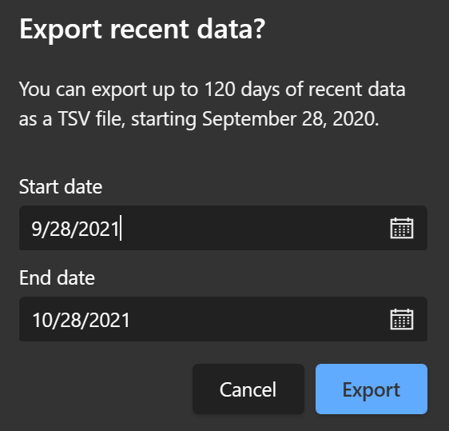
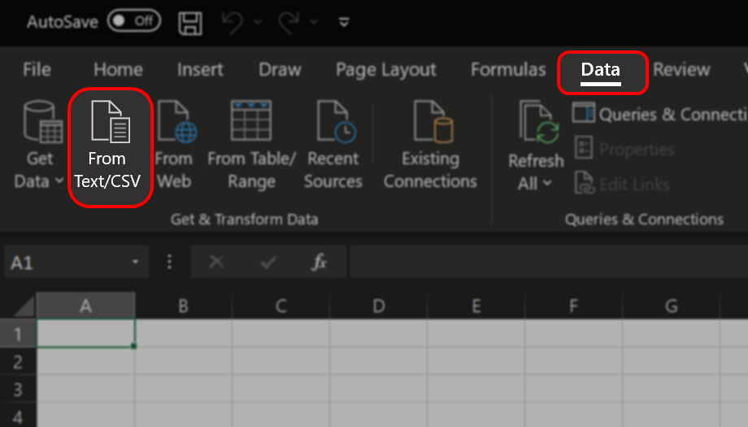
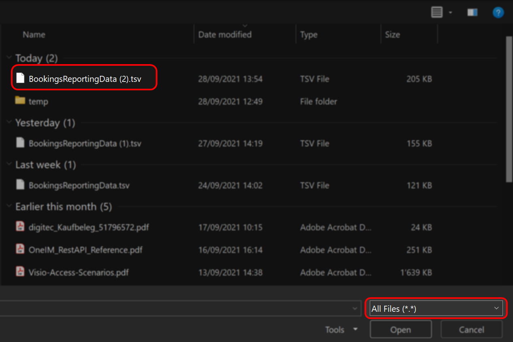
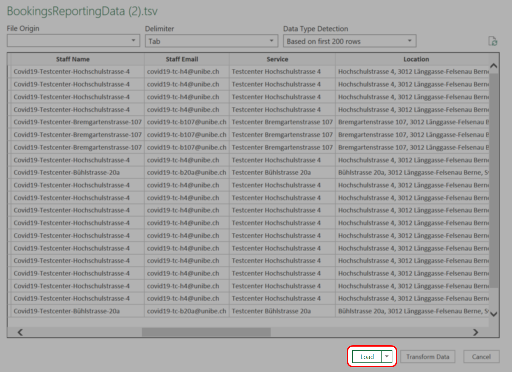

# Einen Bookings-Kalender exportieren
In manchen Situation kann es erforderlich sein, einen Bookings Kalender zu exportieren.  
Gehen Sie dazu wie folgt vor.  

## Anmeldung (COVID-19 Kalender)

1. Verbinden Sie den Sicherheitskey mit ihrem Client  
  

2. Öffnen Sie ein Incognito Browserfenster  
  

3. Navigieren Sie zu [https://outlook.office.com/bookings](https://outlook.office.com/bookings)
4. Wählen Sie die Option ***"Sign-in options"***  
  

5. Wählen Sie nun die Option ***"Sign in with a security key"***  
  

6. Sie werden eine Aufforderung zur Eingabe des Sicherheits-PINs erhalten.  
Geben Sie den erhaltenen PIN ein und berühren Sie den Sicherheitskey an den Seiten (goldene Kontaktstellen), wenn Sie dazu aufgefordert werden.  
  

7. Wählen Sie den gewünschten Testcenter Account aus und bestätigen Sie die Auswahl durch einen Klick auf ***"OK"***  
  

## Kalenderansicht und Datenexport

1. Wechseln Sie in Bookings in die Kalenderansicht und wählen Sie den gewünschten Kalender aus.  
  

2. Klicken Sie auf ***"Export"***  
  

3. Wählen Sie den gewünschten Zeitraum und bestätigen Sie Ihre Auswahl durch einen Klick auf ***"Export"***  
  

4. Speichern Sie die Datei in einem für Sie passenden Ordner ab.  

## Öffnen der Exportdatei in Excel

1. Öffnen Sie Excel, erstellen Sie ein neues Dokument und navigieren Sie in die Registerkarte ***"Data"*** und klicken Sie auf ***"From Text/CSV"***  
  

2. Öffnen Sie die zuvor heruntergeladene Datei, achten Sie hierbai darauf, dass Sie sich alle Dateitypen anzeigen lassen.  
  

3. Das Format wird automatisch erkannt, es sind also keine weiteren Einstellungen notwendig. Bestätigen Sie den import daher mit ***"Load"***.  
  