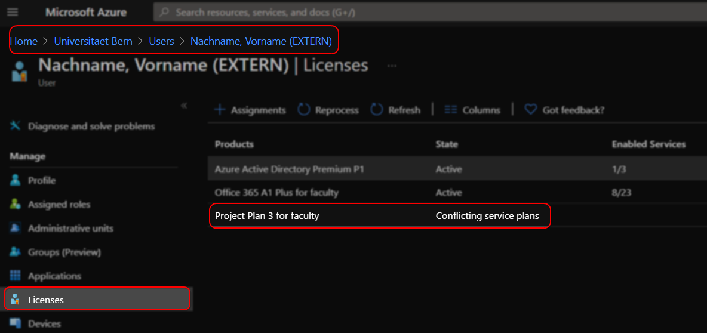
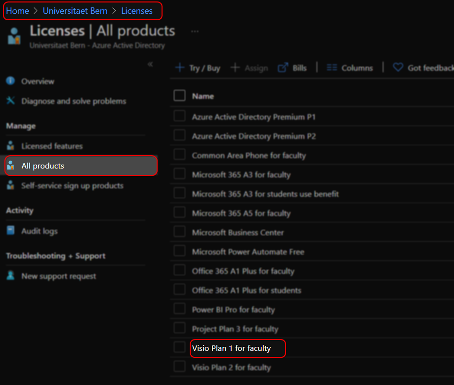
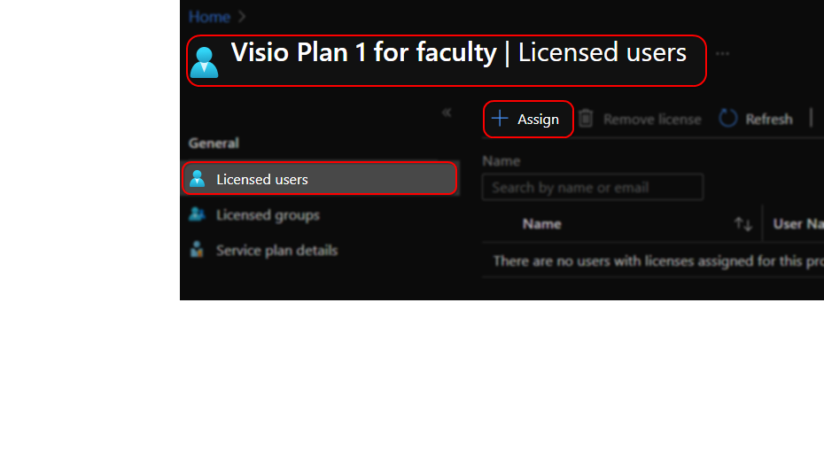
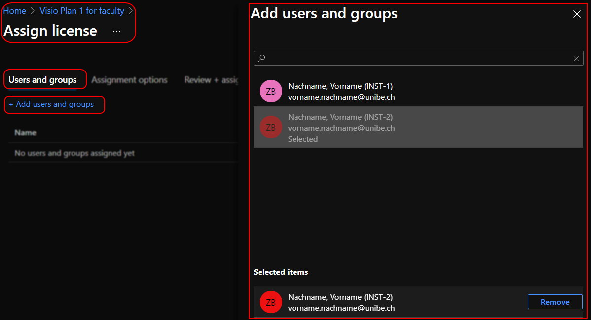
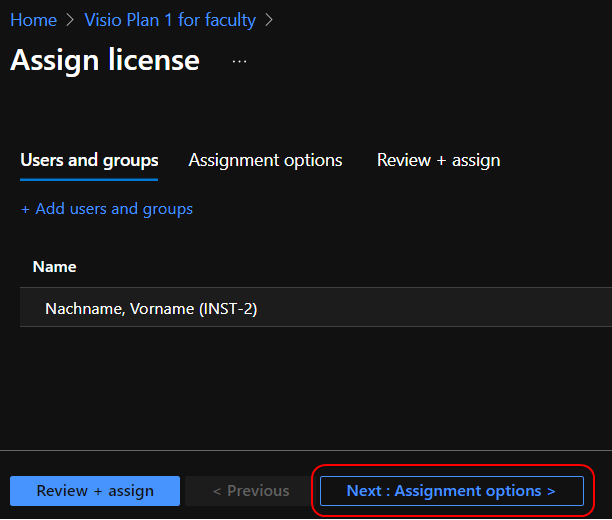
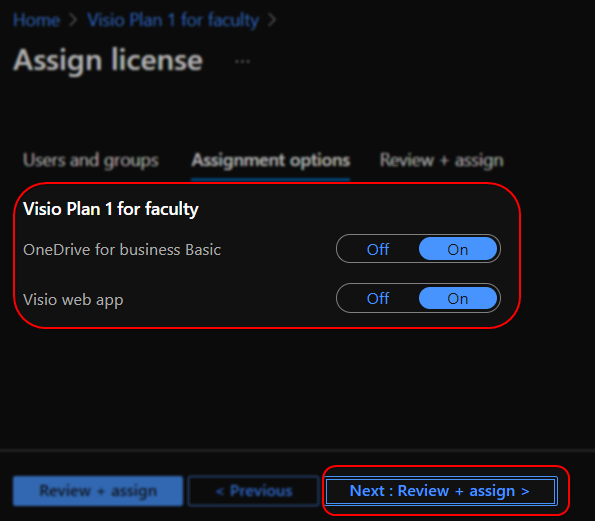
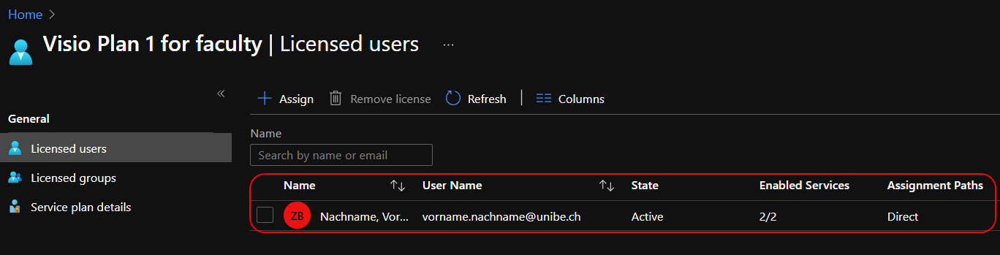

# Zuweisung von Lizenzen via Azure Portal

Wichtig bei der Zuweisung von Lizenzen über das Azure Portal ist die Kenntnis über etwaige Abhängigkeiten.

Eine Project P3 Lizenz beinhaltet bspw. eine OneDrive A5 Lizenz, sie kann also nicht einem Konto mit einer A3 Lizenz zugewiesen werden ohne einen Lizenzkonflikt zu erzeugen.  
Ebenso ist es nicht möglich eine Project P1 / P2 Lizenz einem A1 Konto zuzuweisen da A1 nicht die notwendigen Voraussetzungen für die Verknüpfung einer Project Lizenz mitbringt.

Das M365 Portal würde auf einen solchen Fehler hinweisen. Beim Azure Portal ist dies unter Umständen nicht sofort ersichtlich.

!!! warning
    Lizenzezuweisungen direkt über das Azure Portal haben immer Vorrang vor Zuweisungen über das M365 Portal.

## Lizenzkonflikte anzeigen

1. Melden Sie sich am Azure Portal (https://portal.azure.com) an und aktivieren Sie Ihre Licensing Administrator Rolle[^1].
2. Navigieren Sie zu ***Azure Active Directory*** -> ***Users***
3. Suchen Sie den gewünschten Benutzer und wechseln Sie in die Lizenzverwaltung um etwaige Lizenzierungsfehler zu sehen:  
 

## Eine Lizenz direkt zuordnen

1. Melden Sie sich am Azure Portal (https://portal.azure.com) an und aktivieren Sie Ihre Licensing Administrator Rolle[^1].
2. Navigieren Sie zu ***Azure Active Directory*** -> ***Licenses*** -> ***All Products***
3. Wählen Sie das gewünschte Produkt, hier bspw. ***Visio Plan 1 for faculty***  

4. Wechseln Sie zu den ***Licensed users***. Hier sehen Sie, wem diese Lizenz derzeit zugeordnet ist und können über den ***Assign***-Button weitere Benutzer zuordnen.  
 
5. Klicken Sie dazu auf ***Add users and groups***. Suchen Sie danach nach den gewünschten Benutzern (E-Mail oder Displayname) und klicken Sie diese an um sie zu selektieren.  
 
6. Bestätigen Sie Ihre Auswahl durch einen Klick auf ***Select***
7. Prüfen Sie in der Übersicht nochmals ob alle gewünschten Benutzer ausgewählt wurden und klicken Sie danach auf ***Next: Assignment options***.  

8. Passen Sie hier bei Bedarf die Lizenzierungsoptionen an bspw. um Lizenzkonflikte zu vermeiden und klicken Sie danach auf ***Next: Review and assign***.  

9. Prüfen Sie ein letztes Mal die Zuordnung und klicken Sie auf ***Assign*** um die Lizenzen zuzuweisen.

!!! note
    Es kann etwas dauern bis die Benutzer in der Übersicht angezeigt werden.  
    

[^1]: [Vorgehen analog zur AppDev Rolle](../appdev/appdev-role.md)
